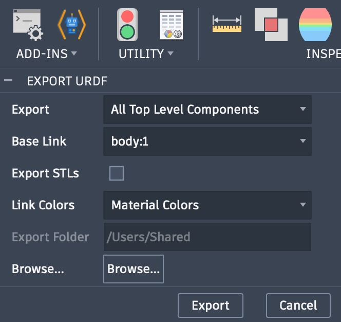
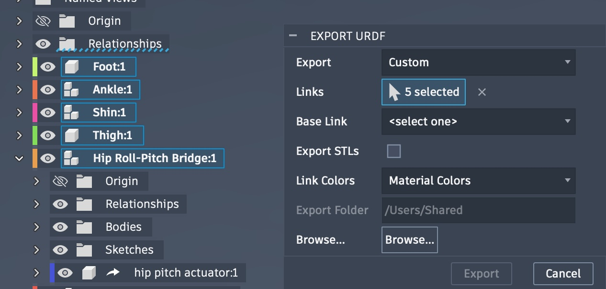
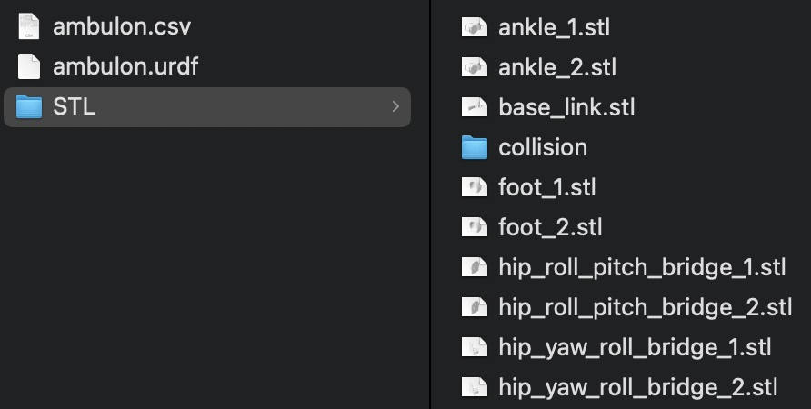
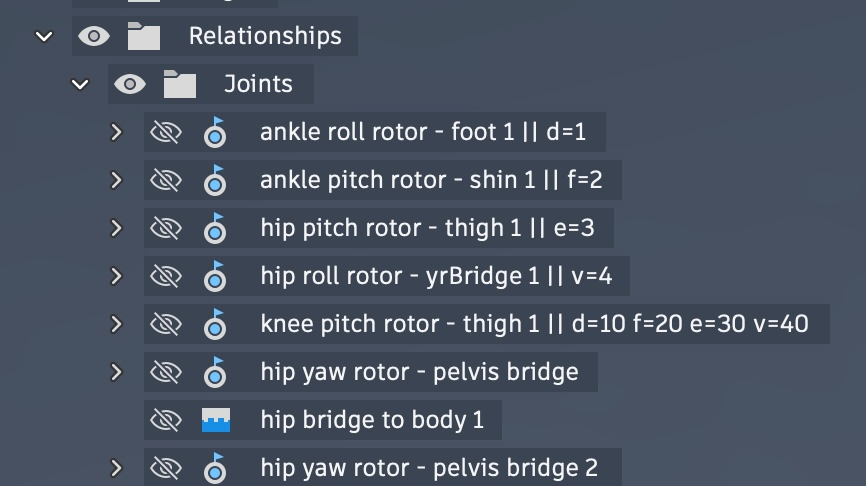
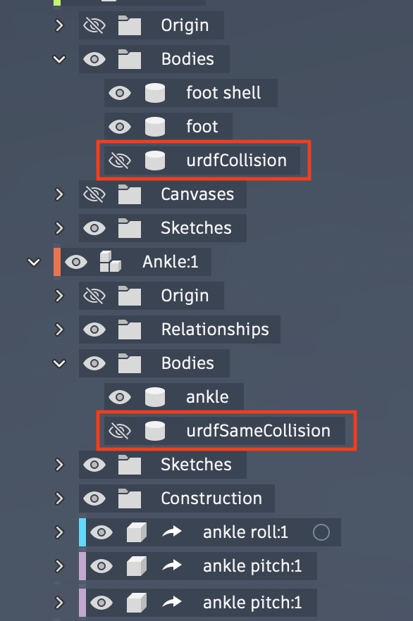

# urdFusion

(**you • are • dee • effusion**) - a portmanteau of URDF and Fusion.

Export your Fusion 360 robot model to URDF with full control over which components become links, without making any changes to your design.

---

## Overview

- **Flexible component selection**: export all visible top-level components, or pick exactly which ones become URDF links.
- **Nested component support**: sub-assemblies are resolved correctly; joints connecting nested actuators to structural links are handled automatically.
- **Joint types**: fixed, revolute (with limits), continuous (revolute without limits), and prismatic joints are all supported. Ball, planar, and pin-slot joints are skipped.
- **Joint limits**: lower and upper limits on revolute and prismatic joints are read directly from Fusion's joint properties.
- **Per-joint simulation parameters**: damping, friction, effort, and velocity can be configured per joint without leaving Fusion. See [Configuring Joint Parameters](#configuring-joint-parameters).
- **Collision meshes**: opt-in per link, using the same mesh as visual or a separate custom geometry body. See [Collision Meshes](#collision-meshes).
- **Link color modes**: assign colors to links based on their physical material, by depth in the kinematic chain (rainbow), or as a single uniform color.
- **Optional STL export**: uncheck to skip STL generation when only URDF or CSV data is needed, making iteration much faster.
- **CSV export**: a `.csv` file is generated alongside the URDF containing all link inertial data, joint parameters, and material assignments. Useful for inspecting or debugging an export without opening the URDF.

---

## Usage

### Exporting

Press the **urdFusion** button in the Fusion toolbar to open the export dialog.



**Export mode**: choose *All Top Level Components* to include every visible top-level occurrence, or *Custom* to select components manually. In custom mode, your selection must collectively cover every visible body in the design - any body not inside a selected component (or one of its children) will be flagged and the export blocked until it is included or hidden.



**Base Link**: select which component becomes `base_link` in the URDF. This is the root of the kinematic tree; all joints are oriented relative to it via BFS traversal.

**Export STLs**: when checked, an STL is exported for each link into an `STL/` subfolder. Uncheck this if your meshes haven't changed and you only need an updated URDF or CSV - it skips the slowest part of the export.

**Link Colors** - three modes:
- *Material*: each link's color is taken from its dominant physical material. If the material has no recognizable flat color (e.g. it uses a texture), a deterministic palette color is assigned instead.
- *Rainbow*: links are colored by their depth from the base link in the kinematic chain, useful for visualizing the structure.
- *Solid color*: all links share a single chosen color.

**Export Folder**: click *Browse* to choose where the `.urdf`, `.csv`, and `STL/` folder are written.

Press **Export** to run. A confirmation dialog appears when complete.



---

### Configuring Joint Parameters

Damping, friction, effort, and velocity can be set per joint by appending a parameter suffix to the joint's name directly in Fusion's browser. No separate panel or file is needed.

**How to set**: double-click a joint in the browser to rename it, then append `||` followed by space-separated `key=value` pairs:

```
elbow_revolute||d=0.5 f=0.1 e=50 v=3.14
```

| Key | Parameter | Default | Notes |
|-----|-----------|---------|-------|
| `d` | damping | omitted | Viscous friction (N·m·s/rad or N·s/m). Omitted from URDF when not set. |
| `f` | friction | omitted | Coulomb friction (N·m or N). Omitted from URDF when not set. |
| `e` | effort | 100.0 | Maximum effort (N·m or N). Always present in `<limit>`. |
| `v` | velocity | 100.0 | Maximum velocity (rad/s or m/s). Always present in `<limit>`. |

Any subset of the four keys may be specified. Extra spaces around `||` and between pairs are ignored. An unknown key or non-numeric value will show an error and abort the export.

The URDF joint name is taken from the part of the name **before** `||`, sanitized to ROS naming conventions.



---

### Collision Meshes

By default, links have no `<collision>` geometry in the URDF. Collision geometry is opt-in per link, controlled by adding a specially named body **directly inside the link's component** (not in a sub-component):

| Body name | Behavior |
|-----------|----------|
| `urdfSameCollision` | The `<collision>` element points to the same STL as `<visual>`. The body geometry does not matter - use any simple placeholder shape (e.g. a small cube). No separate mesh is exported. |
| `urdfCollision` | A separate collision STL is exported to `STL/collision/<link>.stl`. Use this for a simplified convex hull or proxy shape. |

**Zero mass requirement**: both body types must have effectively zero mass. If a collision body has non-negligible mass, a warning will be shown listing the offending links - the extra mass will skew the link's inertial properties. Fusion has no built-in zero-density material, so create a custom material with a density of approximately `0.001 kg/m³` and assign it to the body.

**STL export behavior**: the collision body is automatically hidden before the visual STL is exported and restored afterwards, so it will not appear in the visual mesh regardless of its visibility in the browser.



---

## Installation

1. Clone the repository:
   ```bash
   git clone https://github.com/your-org/urdFusion.git
   ```
2. Create a symlink in Fusion's add-ins directory:
   ```bash
   # macOS
   ln -s /path/to/urdFusion \
     ~/Library/Application\ Support/Autodesk/Autodesk\ Fusion\ 360/API/AddIns/urdFusion

   # Windows (run as Administrator)
   mklink /D "%APPDATA%\Autodesk\Autodesk Fusion 360\API\AddIns\urdFusion" "C:\path\to\urdFusion"
   ```
   Alternatively, copy the folder directly into the AddIns directory instead of symlinking.
3. Open Fusion 360, press **Shift+S**, find `urdFusion` in the **Add-Ins** tab, toggle it **on**, and check **Run on Startup**.

---

## Development

urdFusion is open source and contributions are welcome. Feel free to open issues or submit pull requests.

### Workflow

Fusion caches imported Python modules, so there are two reload paths depending on what you changed:

**Changes to `modules/`** - just press the urdFusion toolbar button. All modules are reloaded automatically before each export, so changes are picked up immediately with no restart required.

**Changes to `urdFusion.py`** - this file is the add-in entry point and cannot be hot-reloaded. Toggle the add-in **off and back on** via Shift+S to pick up changes. This should rarely be needed - the only reason to touch `urdFusion.py` is when adding a new module.

### Adding a new module

1. Add it to the `from modules import ...` line in `urdFusion.py`.
2. Add `importlib.reload(your_module)` to `reloadModules()` in `urdFusion.py`. **Order matters** - modules must be reloaded before any module that imports them. `urdFusionMain` is always last.

---

## Upcoming Features

- **Easier installation via release ZIP**: a GitHub Actions workflow will automatically package each release as a downloadable ZIP. Once available, installation will be: download the ZIP from the Releases page, extract it anywhere, open Fusion 360 and press Shift+S, go to the Add-Ins tab, click the folder icon, navigate to the extracted folder, then toggle it on and check Run on Startup.
